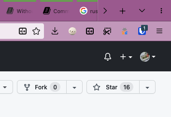

# Container Tab Groups

Chrome-like tab groups using isolated containers: The ultimate tab manager and groups for Firefox.

  
[Download for Firefox](https://addons.mozilla.org/firefox/addon/container-tab-groups/)

## Features

_Tab Group = Container_

- Requires no setup before/after installation.
- Isolated cookies/logins for each of tab groups because they are containers.
- Per-window container management.
- Automatically sorts tabs based on containers.
- Manage tabs based on the domains of websites.
- Provides you with a menu where you can do the following actions:
    - List all the tabs for a window.
    - Show/hide tabs of a container.
    - Create and delete containers as you like.
    - Switch windows.
- Enables First-Party Isolate (privacy.firstparty.isolate; FPI) by default. (Configurable.) **This means that cookies for different sites, even for a same container, are separated by registrable domain.** It also enables natural and flicker-free openings of new windows by websites, unlike simulated FPI by manipulating containers. This is the way Tor Browser is using.
- Allows the user to enable fingerprinting resistance (privacy.resistFingerprinting).

## Usage

The button to open the main controls is by default added at the tab bar at the top, as shown below. The button has three dots.

1. Before starting a task, create a new container for it!
2. Open tabs related to the task in that container.
3. When finished, delete the container to remove all the clutters.

## Intention

This extension is designed to be the best tab group extension/addon for Firefox.

This extension is intended to replace the following features/extensions:

- Conex, an extension which is not updated recently.
- Google Chrome's tab groups.

## Known bugs

- View source (view-source: URLs) on No Container does not work. This is the limitation of WebExtensions API.

## Compatiblity

### Compatible

- Firefox Multi-Account Containers
- Facebook Container
- Temporary Containers
- Tab Session Manager
- Most extensions that changes the New Tab page.

Probably more compatible extensions...

### Incompatible

- Tree Style Tab
- Simple Tab Groups (?)
- Many other tab management extensions? (#32)

### Compatibility To Do's

- Improve the compatibility with top 10 popular tab management extensions, for example
- Export the APIs to work nicely with Tree Style Tab
- Make this extension compatible with Simple Tab Groups, or make this extension feature-rich
enough to unnecessitate Simple Tab Groups.

## What's next

- Keyboard shortcuts will be implemented. → The first implementation is available.

## Available languages

- English
- 日本語
- Français
- Esperanto
- Español
- Русский

### Translators

- metastable-void (ja, eo)
- 佐々木Alex🐇 (Sasaki Alex🐇) (fr, es-ES, ru)

## About the project

- _TabArray_ is the code name, and _Container Tab Groups_ is the user-facing name.
- The official extension ID is `tab-array@menhera.org`. (Not an email address.)
- To contact the developers, use [Google Groups](https://groups.google.com/a/menhera.com/g/ctg-l) or [GitHub discussions](https://github.com/menhera-org/TabArray/discussions).

## FAQs

### Will this be available for Chrome?

This extension depends on many technologies not available in Chrome (only in Firefox),
where the most important is Firefox's isolated containers feature.
So it would not be possible.

### When will (feature) be released?

See the [issues](https://github.com/menhera-org/TabArray/issues).
Something missing you need? Please file a new feature request there.

## Building the extension

1. Install the latest Node.JS/NPM using [NVM](https://github.com/nvm-sh/nvm).
2. In this directory, run `npm install`.
3. Run `npm run build` for production builds, and `npm run dev` for development builds.

## License

Copyright &copy; 2022 Menhera.org contributors.

Licensed under GNU GPL version 3 **or later**.
